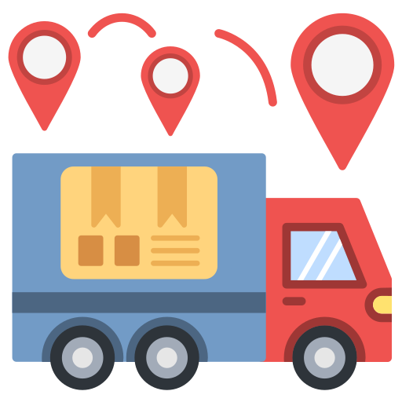

<div align="center">
  
  <h1>Shipment Tracker - Frontend</h1>
  <p>A modern React application for tracking cargo shipments in real-time</p>
  
  <div>
    
    
    
  </div>
</div>

<hr>

## 📋 Table of Contents

- [Overview](#overview)
- [Features](#features)
- [Screenshots](#screenshots)
- [Technologies](#technologies)
- [Installation](#installation)
- [Environment Variables](#environment-variables)
- [Available Scripts](#available-scripts)
- [Folder Structure](#folder-structure)
- [Assumptions](#assumptions)
- [API Integration](#api-integration)

<hr>

## 🔍 Overview

This is the frontend application for the Cargo Shipment Tracker, built using React and Material UI. It provides a user-friendly interface for tracking shipments, viewing their current locations on a map, and managing shipment details.

The application connects to the backend API to fetch and update shipment data, providing real-time tracking information to users.

<hr>

## ✨ Features

<div align="center">
  <table>
    <tr>
      <td align="center">🌐</td>
      <td><strong>Interactive Maps</strong><br>View shipment locations and routes on interactive maps</td>
    </tr>
    <tr>
      <td align="center">📊</td>
      <td><strong>Shipment Dashboard</strong><br>Tabular view of all shipments with filtering and sorting</td>
    </tr>
    <tr>
      <td align="center">➕</td>
      <td><strong>Create Shipments</strong><br>Add new shipments with detailed information</td>
    </tr>
    <tr>
      <td align="center">🔄</td>
      <td><strong>Real-time Updates</strong><br>Update shipment locations and track status changes</td>
    </tr>
    <tr>
      <td align="center">📱</td>
      <td><strong>Responsive Design</strong><br>Works seamlessly on desktop and mobile devices</td>
    </tr>
  </table>
</div>

<hr>

## 📸 Screenshots

<div align="center">
  <p><em>Dashboard view showing shipment list and status</em></p>
  
  
  <p><em>Interactive map showing shipment route and current location</em></p>
  
  
  <p><em>Form for creating new shipments</em></p>
  
</div>

<hr>

## 🛠️ Technologies

- **React 18** - Frontend library
- **Material UI** - Component library for consistent UI
- **React Router** - Navigation and routing
- **Axios** - API requests
- **Leaflet** - Interactive maps
- **Notistack** - Toast notifications

<hr>

## 📥 Installation

Follow these steps to set up the frontend application:

```bash
# Clone the repository
git clone https://github.com/yourusername/tracker-frontend.git

# Navigate to the project directory
cd tracker-frontend

# Install dependencies
npm install

# Start the development server
npm start
```

The application will be available at [http://localhost:3000](http://localhost:3000)

<hr>

## 🔐 Environment Variables

Create a `.env` file in the root directory with the following variables:

```
# API URL for development
REACT_APP_API_URL=http://localhost:5000/api

# Mapbox token for maps (get one at https://account.mapbox.com/)
REACT_APP_MAPBOX_TOKEN=your_mapbox_token_here
```

<hr>

## 📜 Available Scripts

In the project directory, you can run:

- `npm start` - Runs the app in development mode
- `npm run build` - Builds the app for production
- `npm test` - Runs the test suite
- `npm run eject` - Ejects from Create React App

<hr>

## 📁 Folder Structure

```
tracker-frontend/
├── public/               # Public assets
│   ├── favicons/         # Favicon files
│   ├── images/           # Image assets
│   ├── index.html        # HTML template
│   └── manifest.json     # Web app manifest
├── src/
│   ├── components/       # Reusable components
│   ├── context/          # React context providers
│   ├── pages/            # Page components
│   ├── routes/           # Route definitions
│   ├── services/         # API services
│   ├── App.js            # Main App component
│   └── index.js          # Entry point
└── package.json          # Dependencies and scripts
```

<hr>

## 🤔 Assumptions

- The backend API is available at the URL specified in the `.env` file
- Users have modern browsers that support ES6+ features
- Authentication and authorization are handled separately or will be added in future versions
- The application is primarily used on desktop devices, but is responsive for mobile use
- Internet connectivity is required for the application to function properly
- Map data is available through Mapbox API

<hr>

## 🔌 API Integration

The frontend connects to the following backend API endpoints:

- `GET /api/shipments` - Fetch all shipments
- `GET /api/shipments/:trackingNumber` - Fetch a specific shipment
- `POST /api/shipments` - Create a new shipment
- `PATCH /api/shipments/:trackingNumber/location` - Update shipment location
- `GET /api/shipments/:trackingNumber/history` - Get shipment history
- `GET /api/shipments/:trackingNumber/eta` - Get shipment ETA

<div align="center">
  <p>Built with ❤️ by Your Name</p>
</div> 