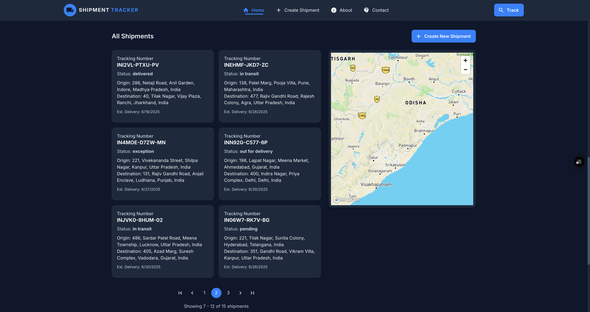
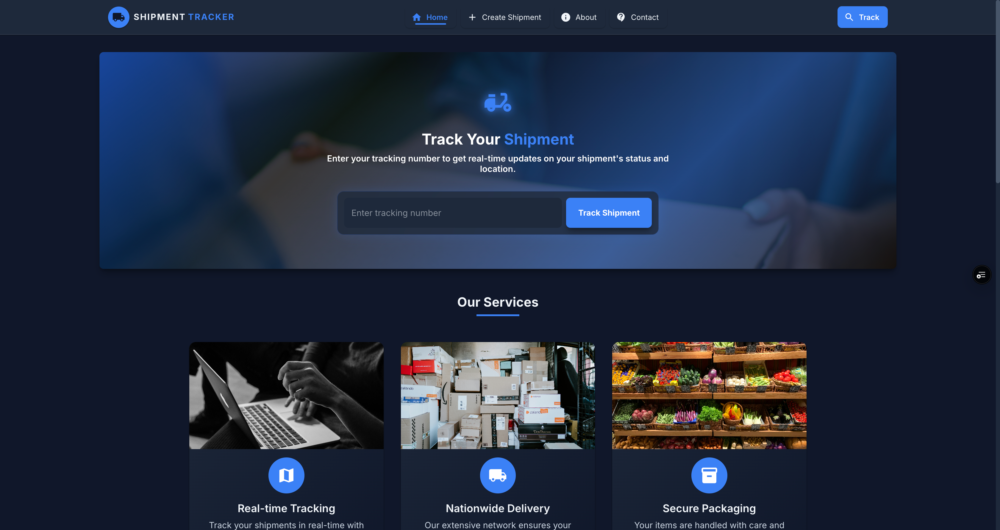
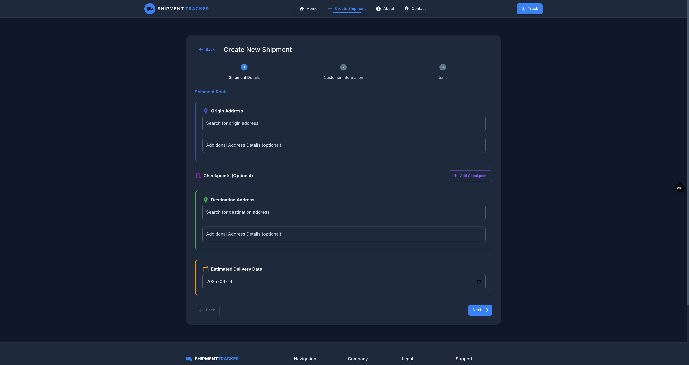

# Shipment Tracker - Frontend


A modern React application for real-time cargo shipment tracking with interactive maps and comprehensive dashboard. Built as part of the MERN Stack Tracking Assignment.

## 🔗 Repository Links
- Frontend: [https://github.com/Anuj-er/cargo-tracker-webapp](https://github.com/Anuj-er/cargo-tracker-webapp)
- Backend: [https://github.com/Anuj-er/cargo-tracker-backend](https://github.com/Anuj-er/cargo-tracker-backend)

## 📋 Assignment Fulfillment

This project implements a complete Cargo Shipment Tracker using the MERN stack as per the assignment requirements:

### Frontend Implementation
- **Dashboard**: Implemented tabular structure listing all shipments with filtering and sorting capabilities
- **Map Integration**: Used Mapbox for interactive maps showing shipment routes and current locations
- **Create Shipment**: Form to add new shipments with container ID and details
- **Update Location**: Interface to update shipment locations
- **Real-time ETA**: Display of estimated time of arrival based on current location

## 📊 Key Features

- **Interactive Maps** - Track shipments in real-time with Mapbox integration
- **Comprehensive Dashboard** - Filter, sort, and manage all shipments
- **Responsive Design** - Optimized for both desktop and mobile devices
- **Real-time Updates** - Live shipment status and location updates
- **Docker Support** - Complete containerization for easy deployment

## 📸 Screenshots

### All Shipments Dashboard
View and manage all shipments in a sortable, filterable table format.



### Shipment Tracking
Track individual shipments with real-time location updates and route visualization.



### Create New Shipment
User-friendly form to add new shipments with container ID and route details.



## 🚀 Live Demo

- Frontend: [https://shipmenttracker.vercel.app/](https://shipmenttracker.vercel.app/)
- Backend API: [https://cargo-tracker-backend-jhy2.onrender.com](https://cargo-tracker-backend-jhy2.onrender.com)

## 🛠️ Technologies

### Frontend Stack
- **React.js** - UI library
- **Mapbox GL** - Interactive maps
- **React Router** - Navigation and routing
- **Axios** - API requests
- **Bootstrap** - Responsive styling

## 🔧 Setup and Installation

### Prerequisites

- [Node.js](https://nodejs.org/) (v14 or later)
- [Docker](https://www.docker.com/get-started) and [Docker Compose](https://docs.docker.com/compose/install/) (optional, for containerized deployment)
- [Mapbox](https://www.mapbox.com/) account for API token

### Environment Variables

Create a `.env` file in the root directory with the following variables:

```
REACT_APP_API_URL=https://cargo-tracker-backend-jhy2.onrender.com/api
REACT_APP_MAPBOX_TOKEN=your_mapbox_token
```

### Installation Options

#### Standard Setup

```bash
# Clone the repository
git clone https://github.com/Anuj-er/cargo-tracker-webapp.git

# Navigate to the project directory
cd cargo-tracker-webapp

# Install dependencies
npm install

# Start the development server
npm start
```

The application will be available at http://localhost:3000

#### Docker Setup (Recommended)

```bash
# Clone the repository
git clone https://github.com/Anuj-er/cargo-tracker-webapp.git

# Navigate to the project directory
cd cargo-tracker-webapp

# Create .env file with required environment variables
echo "REACT_APP_API_URL=https://cargo-tracker-backend-jhy2.onrender.com/api" > .env
echo "REACT_APP_MAPBOX_TOKEN=your_mapbox_token" >> .env

# Make the deploy script executable
chmod +x docker-deploy.sh

# Run the deployment script
./docker-deploy.sh
```

The application will be available at http://localhost

## 📱 Application Structure

### Dashboard View
- Tabular list of all shipments
- Filtering and sorting options
- Quick status overview
- Create new shipment button

### Map View
- Interactive map showing shipment routes
- Current location markers
- Route visualization
- ETA display

### Shipment Management
- Create new shipments
- Update shipment locations
- Track shipment status

## 🤝 Integration with Backend

The frontend communicates with the backend API using the following endpoints:

| Endpoint | Method | Description |
|----------|--------|-------------|
| `/api/shipments` | GET | Retrieve all shipments |
| `/api/shipments/:id` | GET | Get specific shipment details |
| `/api/shipments/:id/update-location` | POST | Update shipment location |
| `/api/shipments/:id/eta` | GET | Get estimated arrival time |
| `/api/shipments` | POST | Create a new shipment |

## 🐳 Docker Commands

### Building and Running
```bash
# Build and start the container (uses docker-compose.yml)
docker-compose up -d --build

# Alternative: Run the deploy script
./docker-deploy.sh
```

### Monitoring and Management
```bash
# View running containers
docker ps

# View container logs
docker-compose logs -f

# View logs for a specific service
docker-compose logs -f webapp

# Check container health
docker ps --format "{{.Names}}: {{.Status}}"
```

### Stopping and Cleaning Up
```bash
# Stop containers
docker-compose down

# Stop containers and remove volumes
docker-compose down -v

# Remove all stopped containers, unused networks, images and volumes
docker system prune -a --volumes
```

### Rebuilding After Changes
```bash
# Rebuild the application after code changes
docker-compose up -d --build
```

## 🚢 Deployment

### Vercel Deployment
1. Connect your GitHub repository to Vercel
2. Configure build settings (automatic)
3. Add environment variables (REACT_APP_API_URL, REACT_APP_MAPBOX_TOKEN)

## 📝 Assumptions

- Users have basic knowledge of shipping logistics
- The backend API is accessible at the specified URL
- Mapbox is used for map visualization
- Each shipment has a unique ID and container ID
- Location updates may be manual or automated
- Authentication is handled separately or will be implemented in future versions

## 📄 License

This project is licensed under the MIT License - see the [LICENSE](LICENSE) file for details. 